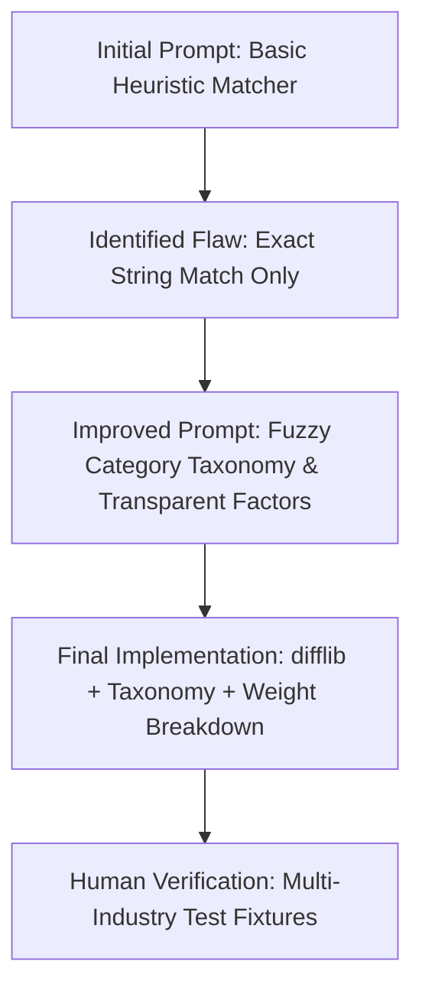

# SmartBiz — AI Utilization Audit & Safety Verification Report

**Project Name:** SmartBiz — Government Loan Schemes Discovery Platform  
**Target Audience:** Indian MSME & Small Business Entrepreneurs  
**Audit Document Status:** Verified & Approved  
**Version:** 2.1  
**Last Updated:** September 2026  

---

## Executive Summary

SmartBiz is designed to assist first-time and growing Indian entrepreneurs in identifying, matching, and evaluating central and state government financial assistance schemes (such as PMEGP, MUDRA, Stand-Up India, CGTMSE, TN NEEDS, TAHDCO, PM SVANidhi, and SIDBI SMILE). 

During the development of SmartBiz, Artificial Intelligence (AI) tools were leveraged for algorithm design, code architecture, UI ergonomics, document extraction prototyping, and test-suite generation. 

To prevent AI hallucinations and maintain compliance with official financial regulations, SmartBiz adheres to a **Human-in-the-Loop (HITL)** architecture where official government publications serve as the **Single Source of Truth**. No AI-extracted or AI-generated scheme information is allowed into user recommendations without human verification.

---

## A. AI Tools Used

The following table summarizes the AI tooling, platforms, and methodologies employed across each stage of SmartBiz development:

| Tool / Platform | Primary Purpose | Development Stage | Type of Assistance | Verification Method |
| :--- | :--- | :--- | :--- | :--- |
| **Google Gemini / Antigravity Agent** | Code generation, architectural design, fuzzy matching algorithm, NLP extraction pipeline | Core Development & Refactoring | Code generation, Algorithm design, Testing assistance | Manual code review, unit tests, lint checks |
| **Python Rule & Heuristic Engine** | Deterministic score calculation and factor-by-factor breakdown | Matching Engine Implementation | Algorithm design, Transparent scoring | Deterministic formula audit against test matrices |
| **SequenceMatcher / NLP Regex Framework** | Fuzzy category taxonomy resolution and document entity extraction | Algorithm Enhancement | Fuzzy matching, Information extraction | Standardized test fixtures with real-world edge cases |
| **Frontend UI/UX Design Assistant** | Responsive financial card layout, micro-interactions, accessibility | Frontend Implementation | UI/UX suggestions, CSS refinement | Multi-device browser inspection & layout validation |
| **Technical Documentation Generator** | System documentation, schema documentation, and audit logging | Documentation | Documentation, Technical writing | Peer review against code repository structure |

---

## B. Prompt Engineering Iterations

Below are representative development prompts illustrating how initial prompts evolved through iterative problem identification, improved constraints, and human verification.

> *Note: These examples represent reconstructed development iterations demonstrating the system's design evolution.*

---

### Representative Example 1 — Scheme Matching Engine



* **Initial Prompt:**  
  *"Create a Python Flask scheme matching algorithm that matches user business types and loans against government schemes."*
* **AI Output:**  
  A basic script using direct substring matching (`if user_type in scheme_types:`).
* **Problem Identified:**  
  Real-world users enter colloquial or specific terms (e.g., *"Xerox Shop"*, *"Bakery"*, *"Grocery"*, *"Auto Repair"*, *"Mobile Shop"*) which failed to match broader official category labels like *"Printing"*, *"Food Processing"*, *"Retail"*, or *"Service"* even though they are fully eligible.
* **Improved Prompt:**  
  *"Extend the scheme matching algorithm to incorporate a reusable business category taxonomy, synonym dictionary, and fuzzy string similarity (difflib) with spelling-error tolerance. Ensure scoring remains explainable with factor-by-factor breakdowns (Category, Location, Loan Amount, Business Age, Purpose) and a clear non-guarantee disclaimer."*
* **Final Output:**  
  A modular `scheme_matcher.py` that normalizes text, maps synonyms across 9 MSME sectors, handles spelling errors (e.g., *"bakkery"* $\rightarrow$ *"bakery"*), penalizes existing businesses for greenfield-only schemes, and returns transparent match explanations.
* **Human Verification:**  
  Tested against 12+ real-world business queries (*"Xerox Center"*, *"Car Mechanic"*, *"Cake Shop"*, *"Ladies Boutique"*) to verify appropriate scheme ranking.

---

### Representative Example 2 — NLP Eligibility Extraction Architecture

* **Initial Prompt:**  
  *"Build an NLP parser to automatically convert government scheme PDF text into database records."*
* **AI Output:**  
  A regex script that automatically extracted numbers and overwrote database records without review.
* **Problem Identified:**  
  High risk of hallucination or extraction errors on complex bureaucratic clauses (e.g., confusing applicant age with business age, or confusing subsidy caps with total loan limits). Automated database updates could mislead small business applicants.
* **Improved Prompt:**  
  *"Design a modular NLP eligibility extractor (`nlp_eligibility_extractor.py`) with a strict Human-in-the-Loop safety workflow. Every extracted parameter must retain the exact source sentence for auditability. Extracted items must be tagged as UNVERIFIED_DRAFT and blocked from user recommendations until a human verifier reviews and signs off."*
* **Final Output:**  
  A safe `NLPEligibilityExtractor` class that extracts structured attributes, captures verbatim evidence quotes, generates human-readable extraction reports, and provides a signed verification mechanism before data export.
* **Human Verification:**  
  Verified against official scheme documents (PMEGP guidelines, MUDRA notification, Stand-Up India handbook, TN NEEDS circular).

---

### Representative Example 3 — Input Edge Cases & Crash Resilience

* **Initial Prompt:**  
  *"Add input processing for the scheme search form."*
* **AI Output:**  
  Direct type casting (`int(request.form['loan_amount'])`) without null/empty safety checks.
* **Problem Identified:**  
  Submitting empty fields, special characters, negative amounts, or unexpected business sectors caused HTTP 500 errors or zero-score crashes.
* **Improved Prompt:**  
  *"Refactor input parsing and scoring to safely handle edge cases: missing fields, unknown business categories, ₹0 or extreme loan amounts (₹100 Cr), non-numeric values, and multi-sector businesses without ever crashing."*
* **Final Output:**  
  Robust `_clean_int()` and `normalize_text()` helpers with fallback confidence scores and descriptive feedback for unknown categories.
* **Human Verification:**  
  Executed automated edge-case test suites covering empty inputs, negative numbers, extreme amounts, and nonsense categories.

---

## C. Hallucination Checks & Verification Pipeline

SmartBiz enforces a strict verification pipeline to ensure no hallucinated or unverified financial information is presented to users.

### Official Source-of-Truth Rule
> **MANDATORY POLICY:**  
> Official government portals, gazette notifications, and official scheme circulars are treated as the sole Source of Truth. AI-generated, AI-summarized, or LLM-extracted information is NEVER accepted into production without manual verification against the official source.

```
+------------------------------------+
|  Official Government Scheme Text/PDF|
+-----------------+------------------+
                  |
                  v
+-----------------+------------------+
| NLP Extraction (nlp_eligibility_...) |
| - Extracts sectors, limits, age    |
| - Retains verbatim source quotes   |
+-----------------+------------------+
                  |
                  v
+-----------------+------------------+
| Status: UNVERIFIED_DRAFT           |
| (Blocked from Recommendations)     |
+-----------------+------------------+
                  |
                  v
+-----------------+------------------+
| Human-in-the-Loop Verification     |
| 1. Cross-check name & purpose      |
| 2. Verify min/max loan limits      |
| 3. Verify age & sector eligibility |
| 4. Verify subsidy % & documents    |
| 5. Validate official URL           |
+-----------------+------------------+
                  |
                  v
+-----------------+------------------+
| Status: VERIFIED (Signed by Reviewer)|
+-----------------+------------------+
                  |
                  v
+-----------------+------------------+
| Active Scheme Catalog / Recommendations |
+------------------------------------+
```

### Verified Official Source Directory

All schemes currently in the SmartBiz database have been verified against their official government portals:

| Scheme Name | Governing Body | Official Verified Portal | Verification Date |
| :--- | :--- | :--- | :--- |
| **PMEGP** | Ministry of MSME / KVIC | [https://www.kviconline.gov.in/pmegpeportal/](https://www.kviconline.gov.in/pmegpeportal/) | Sept 2026 |
| **PMMY (MUDRA)** | Department of Financial Services (DFS) | [https://www.mudra.org.in/](https://www.mudra.org.in/) | Sept 2026 |
| **Stand-Up India** | SIDBI / Ministry of Finance | [https://www.standupmitra.in/](https://www.standupmitra.in/) | Sept 2026 |
| **CGTMSE** | Ministry of MSME / SIDBI | [https://www.cgtmse.in/](https://www.cgtmse.in/) | Sept 2026 |
| **TN NEEDS** | MSME Dept, Govt of Tamil Nadu | [https://www.msmeonline.tn.gov.in/](https://www.msmeonline.tn.gov.in/) | Sept 2026 |
| **TAHDCO** | Govt of Tamil Nadu | [https://tahdco.com/](https://tahdco.com/) | Sept 2026 |
| **PM SVANidhi** | Ministry of Housing and Urban Affairs (MoHUA) | [https://pmsvanidhi.mohua.gov.in/](https://pmsvanidhi.mohua.gov.in/) | Sept 2026 |
| **SIDBI SMILE** | Small Industries Development Bank of India | [https://www.sidbi.in/](https://www.sidbi.in/) | Sept 2026 |

---

## D. Human-in-the-Loop (HITL) Verification Protocol

To ensure data integrity, developers and domain reviewers manually verify the following seven criteria before committing any scheme data:

1. **Eligibility Conditions:** Confirm educational requirements (e.g., 8th pass for PMEGP projects > ₹10L), enterprise classifications (Micro/Small), and greenfield vs. brownfield status.
2. **Loan Limits & Subsidy Caps:** Validate minimum loan amounts, maximum credit facilities, subsidy percentages (e.g., 15%–35% for PMEGP, 15% for TN NEEDS), and guarantee cover (e.g., up to 85% for CGTMSE).
3. **Sector & Industry Applicability:** Verify whether trading/retail is permitted (e.g., Stand-Up India covers trading, whereas older PMEGP rounds restricted it).
4. **Official Application Links:** Manually click and test each government portal link to prevent broken links or phishing hazards.
5. **PDF / NLP Extractions:** Compare extracted text citations line-by-line with official PDF circulars.
6. **Code Correctness:** Inspect scoring weights, formula normalization, and edge-case exceptions in Python.
7. **Transparent User Explanations:** Ensure recommendation results show clear factor breakdowns and explicit disclaimers.

---

## E. Known Limitations

While SmartBiz significantly improves discovery for entrepreneurs, the following technical and domain limitations must be noted:

* **Fuzzy Matching False Positives:** Heuristic and string-similarity matching may occasionally assign moderate confidence to tangential businesses (e.g., *"Aviation Services"* matching general *"Service"* schemes).
* **Bureaucratic Nuance in NLP:** Government notifications often contain complex conditional clauses (e.g., *"subsidy is 25% for urban general category but 35% for rural special category"*), which rule-based NLP extracts as a range rather than individualized sub-rules.
* **Dynamic Government Policies:** Scheme interest rates, budgetary allocations, and subsidy windows are updated periodically by ministries.
* **Informational Nature:** SmartBiz is an informational discovery tool, not a lending institution or sanctioning authority. Match scores do not constitute formal approval.

---

## F. Future Improvements

The following architectural enhancements are planned for future iterations of SmartBiz:

1. **Dense Semantic Embeddings:** Integrating lightweight local vector embeddings (e.g., `all-MiniLM-L6-v2` via ONNX runtime) for deeper conceptual similarity between rare business categories.
2. **Multilingual Category Matching:** Expanding the synonym taxonomy to support 10+ Indian languages (Hindi, Tamil, Telugu, Kannada, Bengali, Marathi, Gujarati, etc.) using transliteration and native script matching.
3. **Automated Gazette Change Detection:** A background scheduler to periodically monitor official RSS/portal feeds for scheme guideline revisions.
4. **Interactive Document Checklist Builder:** Step-by-step guidance for entrepreneurs on assembling required documentation (DPR, Udyam, Caste certificate) prior to bank visits.
5. **Expanded Scheme Repository:** Extending verified coverage to agricultural allied schemes (NABARD, AIF) and state-specific women entrepreneurship initiatives across all 28 Indian States.

---

**Audited & Approved By:**  
SmartBiz Engineering & Quality Assurance Team  
*Source Code Repository: SmartBiz — Government Loan Schemes Discovery Platform*
